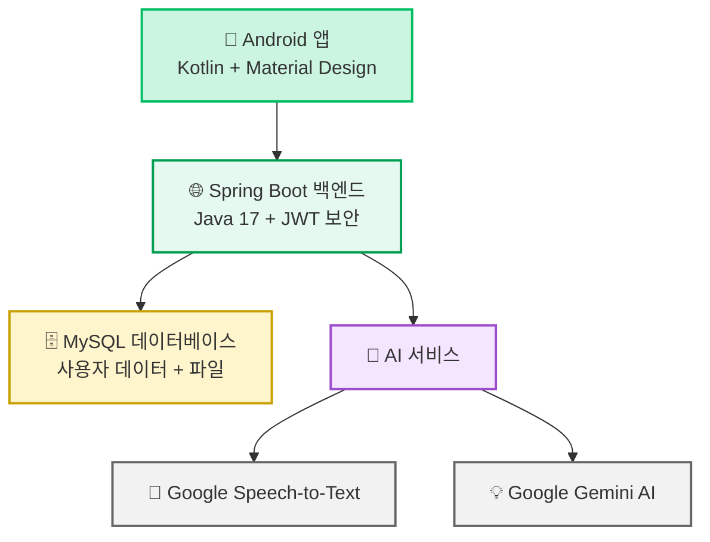
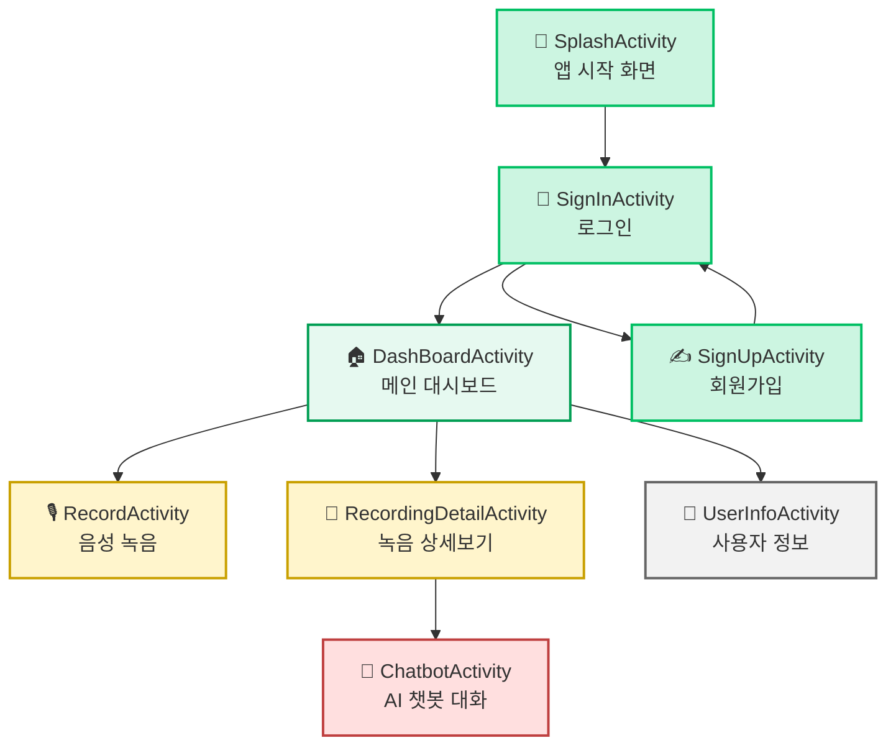
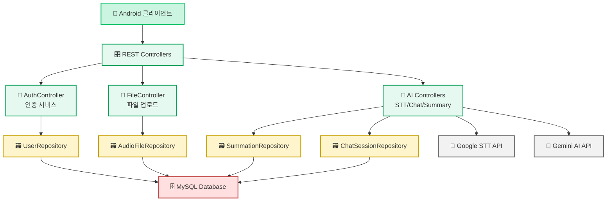

<h1> 🔹 NOTI - 말하는 순간, 회의록이 완성된다</h1>

<div align="center">
  <br>
  <p><strong>AI 기반 음성 기록 및 회의록 자동화 서비스</strong></p>
</div>

## 📖 프로젝트 소개

**NOTI**는 AI 기술과 Spring Boot 백엔드와 Android 앱으로 구성된 음성 기록 및 요약 서비스입니다.

🎯 **핵심 가치**
- 녹음을 진행하면 자동으로 텍스트 변환 및 요약 제공
- AI 기반 대화형 질의응답으로 회의 내용 검색 및 분석

이 서비스는 **회의 후 문서 정리에 어려움을 겪는 직장인들**을 위해 설계되었습니다.
업로드된 음성을 기반으로 회의 스크립트를 자동 생성하고, AI 요약본까지 함께 제공하여

---
## 📽️ 데모 및 결과물

[여기에 데모 영상이나 스크린샷이 추가하기]

## ✨ 주요 기능

### 🎙️ 음성 처리
- **실시간 음성 녹음**: 앱 내에서 직접 회의 녹음 가능
- **STT 변환**: 녹음 파일을 Text로 전환하는 Speech-to-Text 기능

### 🧠 AI 기반 분석
- **스마트 요약**: AI 기반 회의 내용 자동 요약
- **대화형 챗봇**: 회의 내용 기반 질의응답 시스템

### 📱 사용자 경험
- **직관적인 Android UI**: 사용하기 쉬운 모바일 인터페이스

### 🗂️ 데이터 관리
- **클라우드 저장**: 서버 기반 데이터 보관 혹은 사용자의 기기 로컬에 보관 가능
- **파일 관리**: 음성 파일 이름 수정, 삭제 기능
- **사용자 인증**: JWT 기반 보안 시스템

## 🛠 기술 스택

### 🖥️ Backend
- Java 17: 
- Spring Boot 3.4.4: 
- Spring Data JPA: 
- Spring Security: 
- MySQL 8.0: 
- RESTful API: 

### 📱 Android Frontend
- Kotlin: 
- Android SDK (API 28-35): 
- Jetpack Compose: 
- View Binding: 
- OkHttp: 
- Glide: 

### 🎨 UI/UX
- Material Design: 
- Custom Animations: 
- Responsive Layout: 
- Figma: 

### 🔧 개발 도구 및 API
- Google Speech-to-Text API: 
- Google Gemini AI: 
- JWT (JSON Web Token): 
- Postman: 
- Gradle: 

## 📁 프로젝트 구조

```
NotiApp/
├── 📱 android/                 # Android 애플리케이션
│   ├── app/src/main/
│   │   ├── java/com/example/notiapp/
│   │   │   ├── 🏠 DashBoardActivity.kt      # 메인 대시보드
│   │   │   ├── 🎙️ RecordActivity.kt          # 녹음 기능
│   │   │   ├── 💬 ChatbotActivity.kt         # AI 챗봇
│   │   │   ├── 🔐 SignInActivity.kt          # 로그인
│   │   │   └── 📝 RecordingDetailActivity.kt # 녹음 상세
│   │   └── res/                           # 리소스 파일
│   └── build.gradle.kts                   # Android 빌드 설정
│
├── 🖥️ noty/                    # Spring Boot 백엔드
│   ├── src/main/java/com/expert/project/noty/
│   │   ├── 🎛️ controller/                 # REST API 컨트롤러
│   │   │   ├── ai/              # AI 관련 API
│   │   │   ├── auth/            # 인증 API  
│   │   │   └── file/            # 파일 관리 API
│   │   ├── 🧠 service/                    # 비즈니스 로직
│   │   │   ├── ai/              # AI 서비스
│   │   │   ├── auth/            # 인증 서비스
│   │   │   └── file/            # 파일 서비스
│   │   ├── 📊 entity/                     # 데이터베이스 엔티티
│   │   ├── 🗃️ repository/                 # 데이터 접근 계층
│   │   └── ⚙️ config/                     # 설정 파일
│   └── build.gradle                       # 백엔드 빌드 설정
│
└── 📋 document/                # 프로젝트 문서
    ├── agile/                  # 애자일 개발 문서
    └── 활동일지 및 주차별 스크럼/   # 개발 일지
```



### 📱 Android 앱 화면 플로우


### 🔄 백엔드 서비스 흐름


## 🚀 실행 방법

### 1️⃣ 사전 준비
```bash
# 필수 소프트웨어 설치
- Java 17 이상
- Android Studio (최신 버전)
- MySQL 8.0
- Git
```

### 2️⃣ 백엔드 실행 (Spring Boot)
```bash
# 프로젝트 클론
git clone [repository-url]
cd NotiApp/noty

# 데이터베이스 설정 (application.properties 파일 수정)
# MySQL 연결 정보, API 키 등 환경변수 설정

# 애플리케이션 실행
./gradlew bootRun

# 또는 IDE에서 NotyApplication.java 실행
```

### 3️⃣ 안드로이드 앱 실행
```bash
# Android Studio에서 android/ 폴더 열기
cd NotiApp/android

# Gradle 동기화 후 빌드
# Run 'app' 또는 Shift + F10

# 에뮬레이터 또는 실제 디바이스에서 실행
```

### 4️⃣ 환경 설정
```properties
# noty/src/main/resources/application.properties
# 다음 항목들을 실제 값으로 설정:

# 데이터베이스 연결
spring.datasource.url=jdbc:mysql://localhost:3306/noti_db
spring.datasource.username=your_username
spring.datasource.password=your_password

# Google API 키
google.api.key=your_google_api_key

# JWT 시크릿
jwt.secret=your_jwt_secret
```

## 📋 API 문서

### 🔐 인증 API
| Method | Endpoint | 설명 | 
|--------|----------|------|
| POST | `/auth/register` | 회원가입 |
| POST | `/auth/login` | 로그인 |
| PUT | `/auth/modify` | 사용자 정보 수정 |
| GET | `/auth/user-info` | 사용자 정보 조회 |

### 📁 파일 관리 API
| Method | Endpoint | 설명 |
|--------|----------|------|
| POST | `/file/upload` | 음성 파일 업로드 |
| GET | `/file/list` | 파일 목록 조회 |
| GET | `/file/{fileId}` | 파일 정보 조회 |
| PUT | `/file/{fileId}/name` | 파일명 수정 |
| DELETE | `/file/{fileId}` | 파일 삭제 |

### 🤖 AI 서비스 API
| Method | Endpoint | 설명 |
|--------|----------|------|
| POST | `/ai/stt` | 음성을 텍스트로 변환 |
| POST | `/ai/summary` | 텍스트 요약 |
| POST | `/ai/chat` | AI 챗봇 대화 |
| GET | `/ai/sessions` | 챗봇 세션 목록 |
| POST | `/ai/sessions` | 새 챗봇 세션 생성 |

### 📊 응답 예시
```json
{
  "success": true,
  "message": "성공적으로 처리되었습니다",
  "data": {
    "fileId": "uuid-string",
    "fileName": "meeting_record.mp3",
    "transcription": "회의 내용 텍스트...",
    "summary": "회의 요약 내용..."
  }
}
```

## 🗄️ 데이터베이스 구조

### 주요 테이블
```sql
-- 사용자 정보
CREATE TABLE users (
    id BIGINT PRIMARY KEY AUTO_INCREMENT,
    username VARCHAR(50) UNIQUE NOT NULL,
    password VARCHAR(255) NOT NULL,
    email VARCHAR(100),
    created_at TIMESTAMP DEFAULT CURRENT_TIMESTAMP
);

-- 오디오 파일 정보
CREATE TABLE audio_files (
    id BIGINT PRIMARY KEY AUTO_INCREMENT,
    user_id BIGINT NOT NULL,
    original_filename VARCHAR(255),
    stored_filename VARCHAR(255),
    file_path VARCHAR(500),
    file_size BIGINT,
    upload_date TIMESTAMP DEFAULT CURRENT_TIMESTAMP,
    FOREIGN KEY (user_id) REFERENCES users(id)
);

-- 챗봇 세션
CREATE TABLE chatbot_sessions (
    id BIGINT PRIMARY KEY AUTO_INCREMENT,
    user_id BIGINT NOT NULL,
    audio_file_id BIGINT,
    session_name VARCHAR(255),
    status VARCHAR(20) DEFAULT 'ACTIVE',
    created_at TIMESTAMP DEFAULT CURRENT_TIMESTAMP,
    FOREIGN KEY (user_id) REFERENCES users(id),
    FOREIGN KEY (audio_file_id) REFERENCES audio_files(id)
);

-- 채팅 대화 기록
CREATE TABLE chat_conversations (
    id BIGINT PRIMARY KEY AUTO_INCREMENT,
    session_id BIGINT NOT NULL,
    user_message TEXT,
    ai_response TEXT,
    timestamp TIMESTAMP DEFAULT CURRENT_TIMESTAMP,
    FOREIGN KEY (session_id) REFERENCES chatbot_sessions(id)
);
```

## 🔧 개발 환경 설정

### 필수 환경변수
```bash
# Google API 설정
GOOGLE_APPLICATION_CREDENTIALS=/path/to/service-account-key.json
GOOGLE_API_KEY=your_google_api_key

# 데이터베이스 설정
DB_URL=jdbc:mysql://localhost:3306/noti_db
DB_USERNAME=your_username
DB_PASSWORD=your_password

# JWT 설정
JWT_SECRET=your_jwt_secret_key
JWT_EXPIRATION=86400000

# 서버 설정
SERVER_PORT=8080
```

## 🧪 테스트 실행

```bash
# 백엔드 테스트
cd noty
./gradlew test

# Android 테스트
cd android
./gradlew test
./gradlew connectedAndroidTest  # 기기 연결된 상태에서 실행
```

## 🤝 기여 방법

### 개발 워크플로우
1. **이슈 등록**: 버그 리포트나 기능 제안을 GitHub Issues에 등록
2. **포크 & 브랜치**: 레포지토리를 포크하고 새 브랜치 생성
3. **개발**: 코드 컨벤션을 준수하여 개발
4. **테스트**: 변경사항에 대한 테스트 케이스 작성 및 실행
5. **Pull Request**: 상세한 설명과 함께 PR 생성

### 코드 컨벤션
- **Java/Kotlin**: Google Java Style Guide 준수
- **커밋 메시지**: `feat:`, `fix:`, `docs:` 등의 접두사 사용
- **브랜치 명명**: `feature/기능명`, `bugfix/이슈번호` 형식

### 개발 팀
- **프론트엔드**: Android 네이티브 개발
- **백엔드**: Spring Boot REST API 개발  
- **AI/ML**: 음성 인식 및 자연어 처리
- **UI/UX**: 사용자 경험 디자인

## 📄 라이선스
이 프로젝트는 **Apache License 2.0** 하에 배포됩니다.

자유롭게 사용, 수정, 배포할 수 있으며 상업적 목적으로도 사용 가능합니다. 
라이선스는 기여자로부터 사용자에게 특허권을 명시적으로 부여합니다.

전체 라이선스 내용은 [LICENSE](./LICENSE) 파일을 참조하세요.
